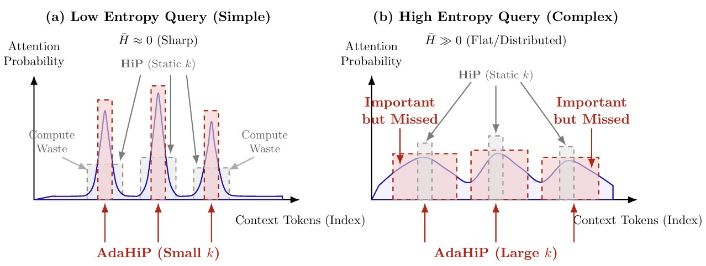

# AdaHiP Attention (Adaptive Hierarchically Pruned Attention)

> Experimental extension of HiP Attention with entropy-based dynamic-k regulation  
> Author: Hyeonseong Sim (KAIST EE)

---

## Overview

AdaHiP (Adaptive Hierarchically Pruned Attention) improves HiP by dynamically adjusting  
the retrieval budget **k** based on attention entropy.

While HiP uses a fixed k for all queries, AdaHiP allocates computation adaptively:

- **Low-entropy queries** → small k (reduce unnecessary computation)
- **High-entropy queries** → large k (preserve important distributed information)

This enables a significantly better trade-off between **perplexity and speed**  
in long-context inference.

---

## Motivation

HiP suffers from a fundamental limitation:

- Fixed k is **too large** for simple queries → wasted computation  
- Fixed k is **too small** for complex queries → important tokens are missed  

This creates a **complexity mismatch problem**.

AdaHiP resolves this by dynamically reallocating compute  
based on query-level informational density.

---

## Conceptual Illustration



---

## Key Idea

AdaHiP estimates normalized attention entropy H(q) and computes:

```
k_dyn = RoundUpTo64(k_min + (k_max - k_min) * x)
```

where:

- x = (alpha * H(q))^p  
- k_min = max(64, k_base / 4)  
- k_max = 2 * k_base  

This enables adaptive compute allocation per query.

---

## Experimental Results

Performance on long-context benchmarks (PG19, 128K context):

| Method | PPL ↓ | Speedup ↑ |
|--------|------|----------|
| FA2    | 12.30 | 1.00x |
| HiP    | 12.63 | 2.18x |
| AdaHiP | 12.46 | 2.08x |

AdaHiP improves perplexity compared to static HiP  
while maintaining sub-quadratic efficiency.

---

## System Configuration

- GPU: NVIDIA L4 (24GB VRAM)
- Model: Llama-3.1-8B-Instruct
- Environment: Docker (Ubuntu 22.04)
- Inference-only (no fine-tuning)

---

## Repository Structure

This repository is based on the original HiP implementation,  
with modifications for AdaHiP dynamic-k attention.

Key modifications:

- Entropy-based dynamic k computation
- Query-level adaptive retrieval
- Experimental evaluation scripts

---

## Getting Started

Clone the repository:

```bash
git clone https://github.com/hyeongus2/adahip-attention.git
cd adahip-attention
```

Run with uv:

```bash
uv sync
uv run src/hip_research/main/model_eval.py
```

---

## Contribution

This project implements an experimental extension of HiP Attention.

Main contributions:

- Identification of static sparsity limitation in HiP
- Entropy-based dynamic-k formulation
- Implementation aligned with GPU execution constraints
- Empirical validation on long-context benchmarks

---

## Citation

If you use this work, please cite:

```bibtex
@misc{sim2025_adahip,
  title={AdaHiP: Adaptive Complexity Regulation for Hierarchically Pruned Attention via Entropy-based Dynamic-k},
  author={Hyeonseong Sim},
  year={2025},
  note={KAIST EE Undergraduate Thesis},
  url={https://github.com/hyeongus2/adahip-attention}
}
```

---

## Acknowledgements

This work builds upon:

- HiP Attention (ICLR 2025)
- FlashAttention-2
- Recent sub-quadratic attention research (Mamba, SAMBA, SWAT)

---

## License

This repository follows the original HiP Attention license.

---

## Paper

Full paper available here:

[📄 AdaHiP Paper (PDF)](./AdaHiP_Hyeonseong_Sim.pdf)

---

## Contact

Hyeonseong Sim  
KAIST School of Electrical Engineering  
Email: hyeongus2@gmail.com / hyeongus2@kaist.ac.kr
GitHub: https://github.com/hyeongus2
